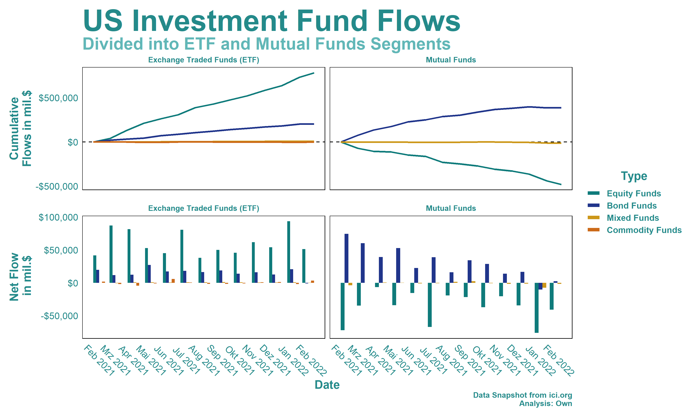
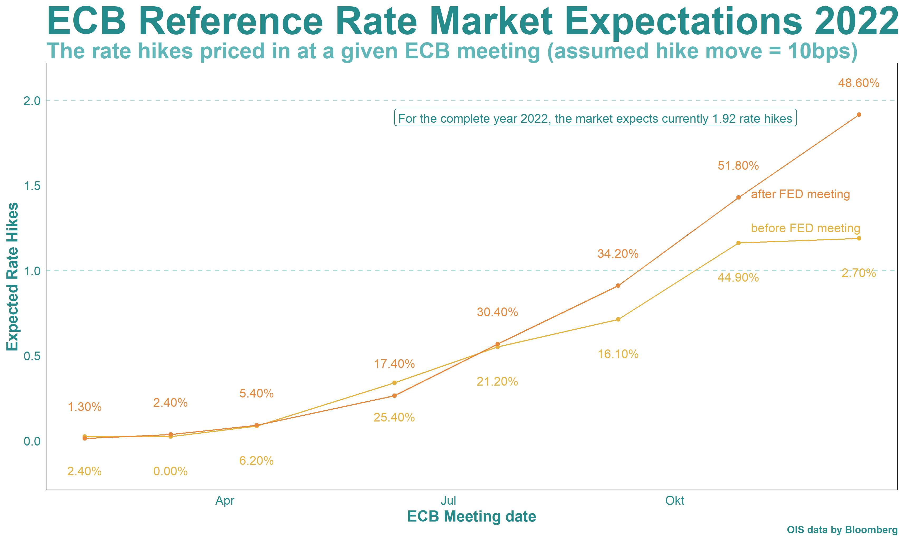
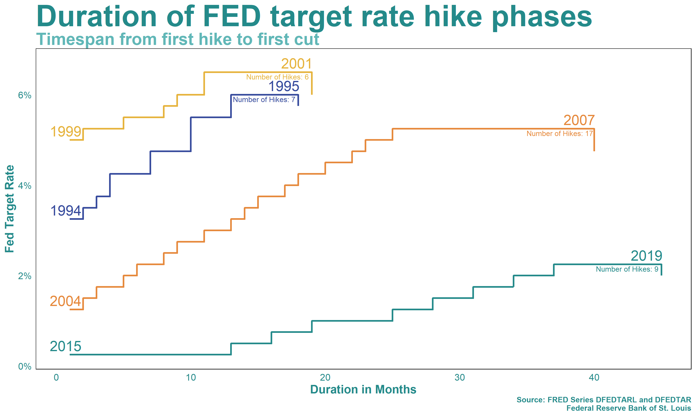

<!-- README.md is generated from README.Rmd. Please edit that file -->

# LinkedIn

<!-- badges: start -->
<!-- badges: end -->

Hey, we are Christian
 and Alex . This is a collection of scripts and visualization we shared on
LinkedIn.

If you have any questions, we’re happy to get in touch so feel free to
reach out on LinkedIn or via Mail
(Christian \| Alex)

## Latest Visualizations

### 03.02.2022 US Investment Fund Flows

The latest analysis was about the current state of the US Fund Market.

### 29.01.2022 ECB Market Expectations

This visualization of the market expectations of the ECBs interest rate
policy was the third part of our “Central Banks” series.

<iframe src="https://www.linkedin.com/embed/feed/update/urn:li:share:6893104683007717376" height="200" width="700" frameborder="0" allowfullscreen title="Embedded post">
</iframe>

### 22.01.2022 FED Hike Cycle History

Expecting a speedup in hiking the reference rate we looked at the FED’s
four most recent hike cycles.

<iframe src="https://www.linkedin.com/embed/feed/update/urn:li:share:6890659498940272640" height="200" width="700" frameborder="0" allowfullscreen title="Embedded post">
</iframe>

